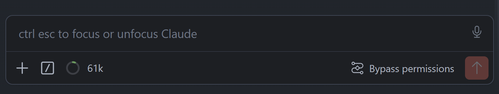
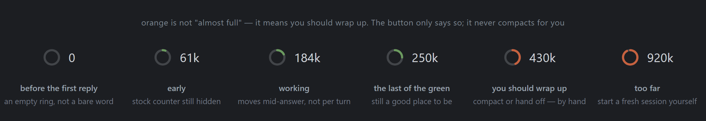
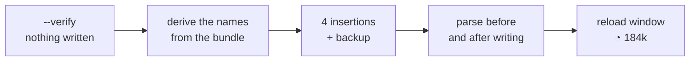

<div align="center">

# vscode-claude-chat-context-meter

### Claude Code skill: a live context meter button in the VS Code chat composer, one click runs /context

[](LICENSE)
[](https://code.claude.com/docs/en/skills)
[](https://marketplace.visualstudio.com/items?itemName=anthropic.claude-code)

**How full the context window is, on screen in every chat you open — sidebar, editor tab, separate window — from the first message, updating itself as the conversation goes and while Claude is still answering. Nothing to ask for, nothing to refresh.
The extension has no API for this: the button is injected into its webview bundle, every edit is an insertion, and `--revert` puts the original back byte for byte.**

[Installation](#installation) · [Usage](#usage) · [How it works](#how-it-works) · [Limitations](#limitations)

</div>

---

## What it does



*The composer, patched: `＋  /  ◔ 61k`. The ring and the count are the button — clicking it runs `/context`.*



*Green until 256k tokens **or** 60% of the window, whichever comes first — on a 1M window that is a quarter full, on a 200k model 120k.*

**The orange is a prompt to you, and only that.** A long context is not free: answers drift long
before the window runs out, so once you are past roughly 256k tokens you should wrap the session up —
run `/compact`, or hand the work over to a fresh chat. Around 400k that is overdue; near the top of a
1M window it is bad. This is why the colour flips at a quarter of a 1M window rather than at the brim.

**Nothing happens automatically.** The button changes colour and nothing else: it never compacts, never
clears, never starts a session for you, and it will sit there in orange indefinitely if you keep going.
Compacting stays a command you run yourself, one `/` menu away — the skill's whole job is to make the
moment visible so the choice is yours rather than a guess.

One bundle serves every Claude Code chat — the sidebar, the chat in an editor tab and the separate
chat window — so a single patch puts the reading in all of them at once, and it is live in each: the
CLI updates the session's usage signal on every assistant message, and the toolbar re-renders with it.
Nothing to run, nothing to refresh, no `/context` round trip to see where you stand.

The Claude Code chat in VS Code is one webview, and its composer toolbar has no extension point —
Anthropic ships none and neither does VS Code. This skill patches the webview bundle in place and
puts a third button next to `+` and `/`: a ring drawn as a real 0–100 sweep plus the token count in
play, e.g. `◔ 184k`. Hovering spells it out (`184k of context used (18% of 1M) — click to run
/context`); clicking executes `/context` immediately, nothing is typed into the input.

Patching someone's daily driver is the whole risk here, so the skill leads with a preflight that
touches nothing but a path cache in `~/.claude` and answers `SAFE TO PATCH` or `UNSAFE: <what did
not match>`. Custom buttons for any slash command work the same way, in any of three composer slots.

| At a glance | |
|---|---:|
| What it does | **a context meter button in the chat composer** |
| The reading | **ring + token count, live mid-answer** |
| Where it shows | **every chat — sidebar, editor tab, separate window** |
| When to wrap up | **orange past 256k tokens or 60% of the window** |
| Acts on its own | **no — it shows the number, you decide** |
| Custom buttons | **any slash command, three slots, three modes** |
| Survives extension updates | **yes — a SessionStart hook restores it** |
| Undo | **`--revert`, byte-exact from the backup** |
| Requires API keys | **no** |
| External dependency | **none — one dependency-free script, nothing to install** |
| License | **MIT** |

## Why

- **`/context` is a round trip** — you type it, read the panel, close it. The one number you wanted was a glance, not a detour.
- **The stock counter appears too late to be useful** — it stays hidden until roughly half the window is gone, which is already well past the point where wrapping up beats carrying on. The number is missing exactly while it could still change what you do.
- **The stock click compacted on the spot** — no confirmation, a hair away from the input box. This button runs `/context` instead; `/compact` stays one `/` menu away.
- **Every extension update wipes the patch** — Claude Code ships a new build every day or two, each into a fresh directory. `--install-hook` puts the button back before you notice it went.
- **There is no supported route to this** — the extension contributes only commands, keybindings, views and an editor title menu. Without patching the bundle, a button in the composer cannot exist.

## Installation

One command, and the skill is available as `/vscode-claude-chat-context-meter`:

```bash
npx skills@latest add warodan/vscode-claude-chat-context-meter
```

The [skills.sh](https://skills.sh/) installer detects the agents you have and asks where to put it.
Node.js is needed for that one command — the skill itself does not require it (see
[Requirements](#requirements)). After it installs, **restart your agent** — skills are read at startup.

**The installer will flag this skill as high risk, and it is not wrong.** skills.sh runs third-party
scanners on every install, and for this one they report `Med Risk` / `Critical Risk` — the skill's
entire job is to edit a file inside an extension you already have installed. Nothing is hidden about
that: [How it works](#how-it-works) lists every edit, the backup taken before the first write, and
`--revert`, which restores the original byte for byte; [Limitations](#limitations) says plainly what
can go wrong. Read those two before you install it.

**Installing the skill does not put the button in — that is a second step, and you ask for it.**
The skill is instructions for your agent, not an installer. Once the agent has restarted, tell it:

```text
put the context button into the Claude Code chat
```

It runs the preflight first, patches only if that comes back clean, and then asks you to reload the
VS Code window — the button is there after the reload. Nothing is written before you ask.

**Where it lands** — the installer asks whether to put the skill into the current project or
globally, for every project; `-g` skips the question and installs globally.

### Or have your agent install it

No terminal of your own, no flags to choose. Open your AI agent — Claude Code, Cursor, Codex — and
paste this to it:

```
Install the vscode-claude-chat-context-meter skill for me. Run in the terminal:

npx skills@latest add warodan/vscode-claude-chat-context-meter -g -y -a <your own agent: claude-code, cursor, codex>

If npx is not found, give me a link to download Node.js and wait.
Do not install anything else.
When you are done, tell me in one line that it is ready and that I need to restart the session.
```

The agent does the rest. This is the **first** install; updating is a different command, below.

### Updating and removing

```bash
npx skills@latest update vscode-claude-chat-context-meter
npx skills@latest remove vscode-claude-chat-context-meter
```

That updates the skill. The **button** is a separate thing: it is wiped by every Claude Code
extension update and comes back on its own once the SessionStart hook is installed — see
[Surviving extension updates](#surviving-extension-updates).

## Usage

The skill is picked up on its own when you ask for something it covers:

```text
put the context button into the Claude Code chat
```

First run. Preflight, then the patch, then it tells you to reload the window — it cannot click the
button for you.

```text
the button is gone after the update, bring it back
```

The everyday case. A fresh extension version means a fresh directory and no patch in it.

```text
make the context button survive extension updates
```

Installs the SessionStart hook, so the button restores itself in the background at the next session.

```text
add a button that runs /usage, put it on the right next to the model picker
```

Custom buttons: any slash command, in the `left` / `slash` / `right` slot.

```text
check whether the patch is still safe on this extension version
```

Read-only preflight: extension version, backup state, toolbar structure, and a trial patch that is
built and parsed without being written.

```text
undo the patch, I want the extension back the way it was
```

`--revert` restores the pristine bundle from the backup taken before the first write.

Or call it explicitly:

```text
/vscode-claude-chat-context-meter put the context button in and make it survive updates
```

## How it works



1. **Find the bundle.** Every editor home is searched — `.vscode`, `.vscode-insiders`, `.vscode-oss`,
   `.vscode-server`, `.cursor`, `.windsurf`, portable and flatpak installs — and every Claude Code
   install found gets the same treatment. The target is `webview/index.js`, one ~4.8 MB minified
   bundle that serves the sidebar, the editor tab and the separate chat window alike.
2. **Preflight (`--verify`).** Checks the version against the ledger of builds already worked out,
   that the backup is clean, that the toolbar structure is where it should be — then builds a trial
   patch and parses it. Answers `SAFE TO PATCH` or names exactly what did not match.
3. **Derive, do not hardcode.** Minified names differ in every build, so they are re-derived each run
   from a single anchor (`title:"Show command menu (/)"`, which must occur exactly once). Roughly
   fifteen structural guards stand behind that: the anchor must sit inside the button element found,
   the toolbar must have exactly one call site, the element is measured by a string-aware bracket
   scan because the anchor text itself contains brackets.
4. **Four insertions, nothing rewritten.** One prop threaded from the input component (where the
   command registry lives) into the toolbar, the handlers, the button itself, and a `return null` that
   silences the stock counter so the two cannot double up. All four are insertions — which is what
   makes the revert exact. The original is backed up to `index.js.orig` first, and the result is
   parsed before *and* re-read after writing; a mismatch restores from the backup.
5. **The reading costs nothing.** No subscription, no timer, no polling: the toolbar already reads
   the session's usage signal to feed its own counter, so it re-renders on every change — the label
   is one division inside that render. The CLI updates that signal on every assistant message of the
   main loop, which is why both halves move mid-answer.
6. **Degrade, never fail.** On a build where the usage signal cannot be located the button falls back
   to a plain run button, and to text-only if just the ring is missing. `--verify` says which of the
   three you are getting.

### Surviving extension updates

`--install-hook` writes a SessionStart hook into `~/.claude/settings.json` that runs a quiet
self-heal in the background. On the boring path it is a couple of `stat` calls against a fingerprint
cache — about 80 ms, all of it Node startup, and it prints nothing. Only a bundle whose fingerprint
moved is reopened and re-patched. A lock file keeps two editor windows starting at once from writing
the same file, `settings.json` is backed up before any write, other people's hooks are never touched,
and the hook never exits non-zero — a session that reports a failure every morning would be worse
than the problem it solves. The restored button appears at the **next window reload**; in practice
the update asks for one anyway.

The hook is written only when you ask for it, and it is a write into your `settings.json`: the file
is copied to `settings.json.ccm.bak` before the first one, other people's hooks are left alone, and
`--uninstall-hook` removes exactly our entry and nothing else. `--status` says whether it is in
place.

## Requirements

| Requirement | Details |
|---|---|
| VS Code with the Claude Code extension | `anthropic.claude-code` — **the point of the skill**. Insiders, VSCodium, Cursor, Windsurf and remote/WSL installs are searched too. Outside VS Code there is nothing to patch |
| Claude Code as the agent | it is Claude Code's own chat UI that gets the button, and the self-heal hook is a Claude Code hook. Another agent can run the patcher, but it cannot install the hook |
| A Node-capable runtime | **nothing to install**: `node` from PATH, otherwise the editor's own Electron binary (`ELECTRON_RUN_AS_NODE=1`). Anyone patching a VS Code extension has that editor by definition |
| A shell | `sh` (Git Bash on Windows) for `run.sh`, or PowerShell for `run.ps1` |
| Write access to the extension folder | the patch edits `webview/index.js` in place and keeps a backup beside it |

## What's inside

```
vscode-claude-chat-context-meter/          # the repository
├── skills/vscode-claude-chat-context-meter/   # ← the only thing that gets installed
│   ├── SKILL.md                # the skill: protocol, commands, limits
│   ├── references/
│   │   ├── internals.md        # how the patch works: edits, safeguards, the ring
│   │   └── layout-recovery.md  # what to do when an update rewrites the toolbar
│   ├── patch_claude_code_ui.mjs  # the patcher — one file, no dependencies
│   ├── run.sh                  # POSIX runner: finds a Node-capable runtime
│   ├── run.ps1                 # the same, for PowerShell
│   ├── verified-versions.json  # ledger of extension builds already worked out
│   └── LICENSE
├── assets/                     # the screenshots this README shows
├── LICENSE
└── README.md
```

## Limitations

- **VS Code and the Claude Code extension, nothing else.** The button is injected into that
  extension's webview bundle; there is no CLI, JetBrains or web equivalent, and outside VS Code (or a
  fork of it) the skill has nothing to do.
- **It patches an installed extension, and that is a real risk.** A rewritten toolbar makes the
  preflight refuse rather than guess, because a broken bundle means the Claude Code chat does not
  open at all. Nothing is written without a passing `--verify` and a validated backup, but the
  honest summary is: this is a patch, not an integration.
- **A restored button shows up at the next window reload.** The webview is already loaded by the time
  a session starts, so the self-heal cannot bring it back into a window that is already open.
- **Only what the bundle already has.** The button can reach registry commands, text insertion and
  mode switching. Invoking an arbitrary VS Code command would need `extension.js` patched as well —
  far more brittle, and deliberately not supported here.
- **The reading is only as good as the CLI's signal.** There is no exact window size before the first
  completed turn (the model id supplies a flagged guess until then), and it counts the **main loop** —
  a subagent burning tokens does not move it.
- **It advises, it does not act.** The button never compacts, clears or hands off — turning orange is
  the entire behaviour. Clicking it runs `/context`, not `/compact` (which the stock counter did, on
  the spot and without confirmation); when the colour says wrap up, doing it is your move.
- **Extension builds move fast.** Everything is derived from the bundle rather than hardcoded, and the
  ledger currently carries six builds, up to 2.1.226 — but a genuinely restructured toolbar needs the skill's
  anchor re-taught, which is a documented procedure rather than an automatic one.

## License

MIT — see [LICENSE](LICENSE). © 2026 Daniel Orr.

An independent project, not affiliated with or endorsed by Anthropic. "Claude" and "Claude Code" are
Anthropic's marks; the extension this skill patches is theirs, and the patch is reversible by design.

---

<div align="center">
<sub><b>Skills for Claude Code</b> · <a href="https://github.com/warodan?tab=repositories">more skills in the series</a></sub>
</div>
